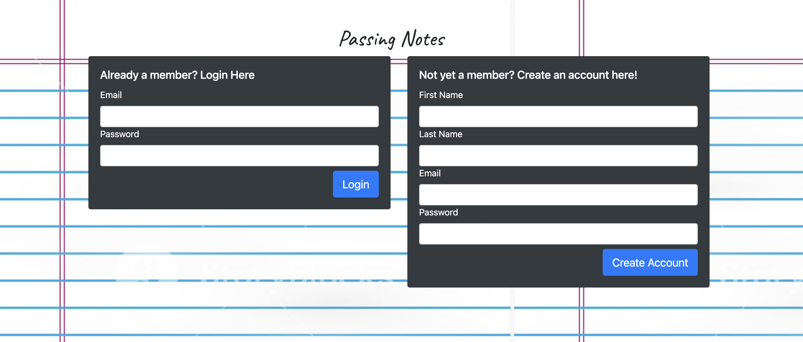
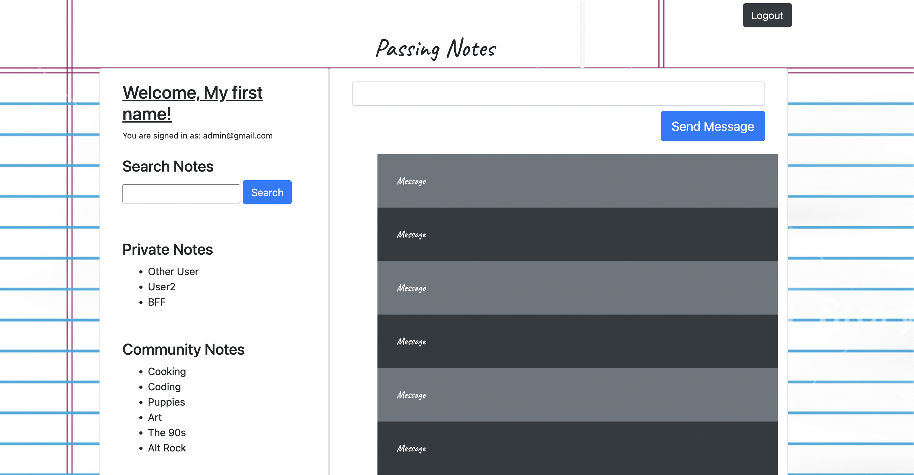

# Passing-Notes-Chat-App

<a href="" title="Deployed Passing Notes Chat App" target="_blank">Deployed App on Heroku (Under Construction)</a>

---

## Description

Take a step back in time to the days of passing notes in class and AOL instant messaging! Passing Notes is a new messaging app that combines the simplicity of instant messaging with the retro look of the notes you passed in middle school, but these notes will be harder for your teacher to take up and read in front of the class!

---

| Table of Contents       |
| ----------------------- |
| [How to Use](#usage)    |
| [License](#license)     |
| [Credits](#credits)     |
| [Questions](#questions) |

---

## Usage

On the homepage, the user may choose between logging into an existing account or creating a new account. 

The user will be directed to the login page where they can enter the credentials for an existing account or create a new account. 

The user will see a pop-up which shows their authentication.

The user will be directed to the messages page where they can send and receive messages. 

---

## License

This project is under the MIT license. Read about this license at [MIT license](https://choosealicense.com/licenses/mit/).

---

## Credits

This app was created using the [Firebase](https://firebase.google.com/) app development platform.

---

## Questions?

| Creator        | GitHub                                                 | Email                    |
| -------------- | ------------------------------------------------------ | ------------------------ |
| Lindsey Jones  | [Lindsey's GitHub](https://www.github.com/L-Jones-hub) | lindseyjones92@gmail.com |
| Rebecca Nunez  | [Rebecca's Github](https://github.com/bekkanunez)      | rebnunez@gmail.com       |
| Keshon Royster | [Keshon's GitHub](https://github.com/Keshon97)         | k.royster512@gmail.com   |
| Penelope Leung | [Penelope's GitHub](https://github.com/penelope-leung) | penguin812@gmail.com     |

## References

[Firebase-Back to the Basics](https://www.youtube.com/watch?v=q5J5ho7YUhA&list=RDLVrQvOAnNvcNQ&index=5)

[Getting Started with Firebase 9 #14 - Subscribing to Auth Changes](https://www.youtube.com/watch?v=xYr-GbvqrYY&list=PL4cUxeGkcC9jERUGvbudErNCeSZHWUVlb&index=14)

[Firebase Auth Tutorial #15- Firestore Users Collection](https://www.youtube.com/watch?v=qWy9ylc3f9U&t=389s)

[How to Build a Chat App with Firebase](https://www.cometchat.com/tutorials/how-to-build-a-chat-app-with-firebase)